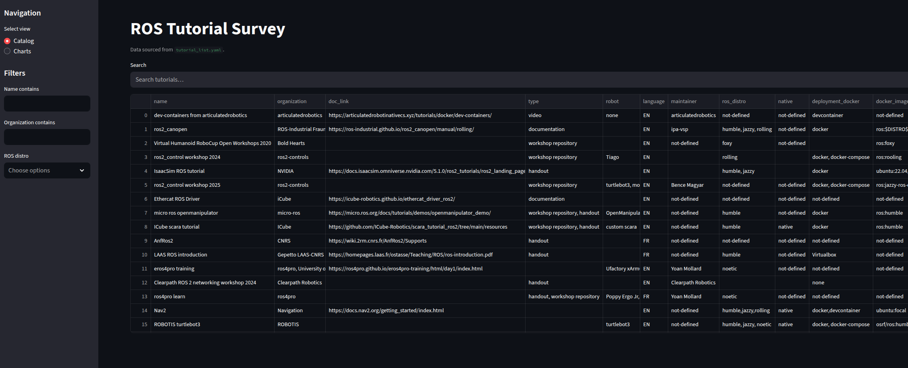
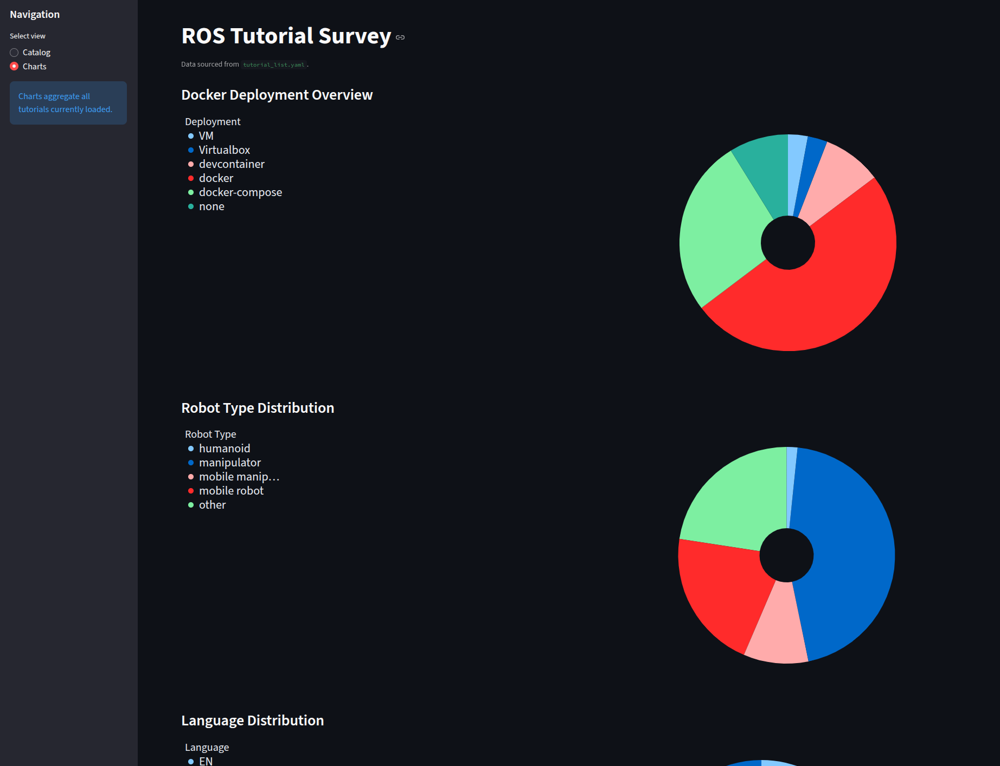

# ROS Training Material Survey

## Why this repo ?
The repo was created by Yasmine Makkaoui (Fraunhofer IPA) and Gauthier Hentz (Université de Strasbourg) as a contribution to their talk at ROSCon FR&DE 2025 entitled "How to start teaching ROS2 in 2025 ?"
Its aim is to help people find most relevant Material when starting to Teach and Use Open Source Robotics with the diversity of technologies, applications, hardware and software stacks available.
We hope it will push external contributions to the best Open Source Robotics Training Material.
It may also deserve the purpose of pushing the adoption of Open Source Robotics Toolchains for demonstrations and industrial applications.


## Description of fields qualifying the Training Material
- `name`: Description of the Training Material
- `organization`: Owner of the Material
- `date`: Creation or last major update year
- `governance`: `[company,consortium,laboratory,university,community,individual]`, ex. Fraunhofer IPA or ICube as `laboratory`, ROS-Industrial or [ros-controls](https://control.ros.org/rolling/doc/governance/governance.html) (OSRA) as `consortium`
- `organization_country`: `[de,us,es,fr,gb,it]`
- `maintainer`: Contact of known expert contributors/maintainers, e.g. GitHub handle or email
- `user`: Contact of known trainers/users, e.g. GitHub handle or email
- `intro`: Introduction page to the Material, e.g. on [ROS Discourse](https://discourse.openrobotics.org/t/mini-workshop-developing-and-teaching-ros-from-a-web-browser-using-dev-containers-and-pwas/31533) or organization website
- `doc`: Documentation URL, e.g. https://robgineer.github.io/cobot/
- `doc_type`: `[pdf, sphinx, markdown, workshop repository]`
- `language`: `[de,en,es,fr,gb,it]`
- `technology`: `[manipulation,navigation,perception,software-engineering,fieldbus]`, Robotics Technology covered by the Material
- `application`: `[welding,pickplace,palletizing,conveying,humanoid]` Robotics Application covered by the Material  
- `robot`: `[ur5e,ur10e,panda,pcobot,scara,turtlebot3]`
- `hardware`: `[stm32_f407,raspberry_pi4,jetson_nano,nvidia_gpu,tof_vl53l1x]` Hardware, other than robot and ROS-machine (AMD64 PC) required for running the Material
- `stack`: `[basics,ros2_control,urdf,gazebo,rviz,moveit,nav2,tesseract,opencv,pytorch]`, Robotics software Stack covered by the Material (ROS and non-ROS)
- `repo`: Code Repository URL, e.g. https://github.com/robgineer/cobot
  - Note: Some automated scrapping is impremented for GitHub repos
- `packages`: Software Packages covered by the Material
- `distro`: `[humble,jazzy,rolling,windows10,debian12]` ROS distro or other specific OS supported by the Material
- `deploy_native`: `[bash,ansible,iso,fai]` Method for native deployment on a machine (without container), e.g. (https://fai-project.org/)
- `deploy_gui`: `[x11local,x11forward,tigervnc,webapp]` Method to display ROS GUI, e.g. if developing on a remote machine
- `deploy_specifics`: `[devcontainer,virtualbox,clusterssh]`
- `deploy_docker`: `[dockerfile,dockercompose,rocker,ade]`
- `docker_image_base`: `tiryoh/ros2-desktop-vnc:jazzy`
- `docker_overlay`: `[builder,dever,visualizer]`
- `ci`: `true` Continuous Integration
- `legacy`: `[true,false]`, The Material is not considered relevant enough anymore, and will not display on the website

## Governance
This repo is hosted under https://github.com/ROS-French-Users-Group which currently gathers French speaking researchers, teachers and engineers from different institutions, mostly public Research Institutes and Universities. This GitHub organization is cross-organizational and closely related to the Association [FUSER](https://discourse.openrobotics.org/t/association-francophone-des-utilisateurs-du-systeme-dexploitation-robotique/37918) founded to help people organize ROSConFR. 
Permissions on the repo are shared with the ROS-Industrial organization https://github.com/ros-industrial/, which gathers mostly Ros Community members from the USA, Germany, the Netherlands, Austria, Singapore and Japan. ROS-Industrial consists of three consortia led by Frauhofer IPA in Stuttgart, Germany for the Consortium Europe, South-West Research Institute in San Antonio, USA for the Consortium North-America and ARTC in Singapore for the Consortium Asia-Pacific, see https://rosindustrial.org/ric-eu . We hope the criteria below will enable objective maintenance of the recommended Material.

## Criteria

The criteria for Material to be included in the list are as follows:
- Material should be Open Source, under licence... and theirs maintainers open to relevant contribution.
- We do not include Material dedicated to very specific software packages, such as a driver user documentation, but rather focus on Material that enables solving a robotics application.
- We do include Material provided by the ROS Stack communities (WG), e.g. ROS2, Nav2, MoveIt2, ROS2-Control Tutorials, as they serve as a primary reference for many other Material, and it allows to follow and compare their Best Practices.
- Ideally, there should be a public reference to the Material (e.g. on its organization website, or on Open Robotics Discourse) to prevent us from advertising material that "is not really Open Source" or presents a high "risk to disappear".
- We encourage even recent initiatives even if they have not proven long term maintenance. Hence, we think these are the ones that require high visibility to develop a community. 
- Material that is not considered relevant anymore will be marked as `legacy` and removed from the published website. Legacy Material will still be searchable from the `.yaml` file.

Criteria considered for evaluating the relevance of Material:
- Sufficiently maintained: number of maintainers, contributors, last contribution date, ROS distro, open to contribution
- Popular: number of users, github stars, maintained by reknown ROS contributor
- Doc or Repo relative quality : better than that of other Materials covering similar contents
- Contents poorly covered by other Materials: Applications, technologies, robots or stacks not adressed
- Good quality documentation: with limited scope and a given target group in mind
- Good quality repo: distro coverage, easy deployment

# Contribute to ROS Tutorial Catalog
If suggesting a relevant change, make sure to hint how you're related to the Material. Are you a Maintainer ? A member of the organization ? A User ? A simple tester ?
Send a Pull Request with additions, modifications or removals. 

Streamlit interface for exploring tutorials listed in [`tutorial_list.yaml`](tutorial_list.yaml). Use the options below to run and develop the app with Docker Compose, VS Code Dev Containers, or a local Python environment.




## Run with Docker Compose

- Build and start the base image (runs `python3 streamlit_app.py` inside the container to validate dependencies; it exits once the script finishes):

  ```sh
  docker compose -f docker/docker-compose.yml up local-streamlit-built
  ```

- For the Streamlit dev server with live reload and a mounted workspace:

  ```sh
  docker compose -f docker/docker-compose.yml up local-streamlit-run
  ```

- Visit http://localhost:8501 when using the dev server (`local-streamlit-run` maps host 8501 ➜ container 8501). Stop that service with `Ctrl+C` before starting anything else on the same port.
- Stop services with:
  ```sh
  docker compose -f docker/docker-compose.yml down
  ```

## VS Code Dev Container

- Requires the Dev Containers extension (or GitHub Codespaces)
- Run “Dev Containers: Reopen in Container” from the command palette; the environment uses `mcr.microsoft.com/devcontainers/python:3.11`
- Post-create script installs helpful shell aliases (see `.devcontainer/bashrc.sh`)
- Base image ships with Python 3.11, `pip`, `pipx`, `pytest`, Git, and other common CLI utilities; add extra linters (e.g., Ruff, Flake8) via `pip install` as needed
- Launch the app with `streamlit run streamlit_app.py --server.address=0.0.0.0 --server.port=8501`

## Run Natively

- Create an isolated environment:
  ```
  python3 -m venv .venv && source .venv/bin/activate
  ```
- Upgrade build tooling: `pip install --upgrade pip`
- Install project deps: `pip install -r requirements.txt`
- Start the UI: `streamlit run streamlit_app.py`
- Visit http://localhost:8501 and exit with `Ctrl+C` when done

## Adding Tutorials

- Edit [`tutorial_list.yaml`](tutorial_list.yaml); each entry is a YAML mapping describing a Training Material
- Required fields: `name`, `organization`, and at least one of `doc` or `repo`
- Optional metadata (e.g., `language`, `distro`, `robot`) improves filtering and analytics in the app
- Values that can take multiple items (like `distro`, `robot`) may be written as YAML lists or comma-separated strings
- After saving, restart or refresh the Streamlit app to load the new entry
